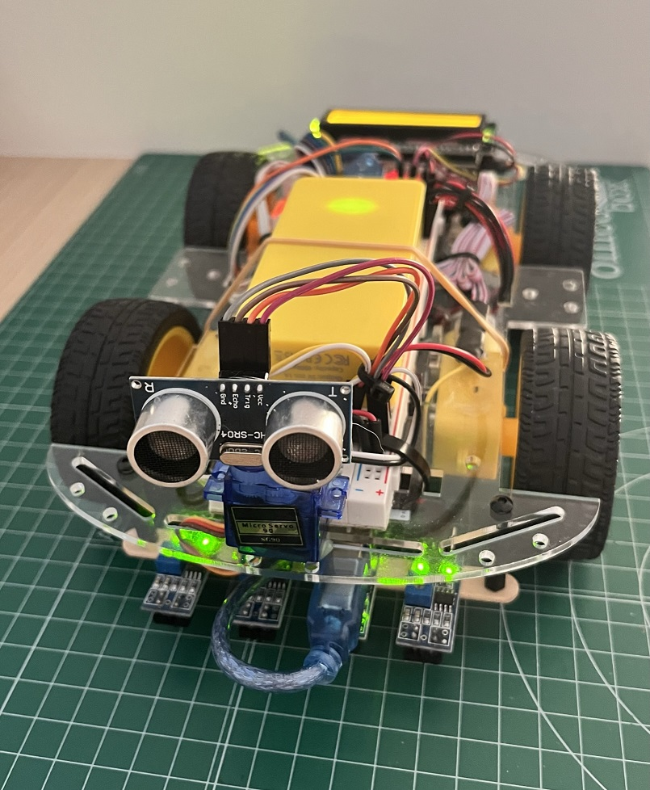

# Smart4car_Linea  

Autor: Jordi Rodríguez  
  
Práctica de programación de Clases y Objetos en Arduino  
Crearemos un vehículo de 4 ruedas con el material especificado  
Para la programación usaremos la plataforma Arduino IDE:  

https://www.arduino.cc/en/software  

Se han incluido las siguientes librerías:  

- LiquidCrystal I2C  
https://github.com/fdebrabander/Arduino-LiquidCrystal-I2C-library  

Este código realiza las siguientes funciones simples:   
- Lectura de 4 sensores de línea  
- Actúa sobre los motores para seguir la línea negra  

En este caso, aunque esté montado, no usaremos:  
- El sensor de distancia  
- El servo  
- Los encoders  
- Ningún control PID  
  
  
  

## Material utilizado  

- 1 x HC-SR04 = Sensor ultrasonido de distancia  
- 1 x SG90 = MicroServo 9g  
- 4 x TCRT5000 = Sensor infrarrojo de proximidad  
- LCD I2C = Pantalla lcd  
- L298N = Controlador de motores  
- 4 x Motores Arduino  
- 2 x Encoders motores Arduino (alimentados a 3'3v)  
- Protoboard  
  

## Pines de conexion  

A0 = Servo frontal  
A1 = Sensor ultrasonido-Echo (HC-SR04)  
A2 = Sensor ultrasonido-Trigger (HC-SR04)  
A3 =   
A4 = I2C LCD (SDA)  
A5 = I2C LCD (SCL)  
D0 = (RX)  
D1 = (TX)  
D2 = (INT0) Encoder izquierdo  
D3-= (INT1) Encoder derecho  
D4 = Sensor línea izquierda extremo     
D5-= ENB motor izquierdo  
D6-= ENA motor derecho  
D7 = IN1 motor derecho  
D8 = IN2 motor derecho  
D9-= IN3 motor izquierdo  
D10-= IN4 motor izquierdo  
D11-= Sensor línea izquierda  
D12 = Sensor línea derecha   
D13 = Sensor línea derecha extremo  
